# README

## 1. Detailed Hyperparameter Study Experiments

### Single-source experiments on distribution-level metrics

<table>
  <tr>
    <td align="center">
      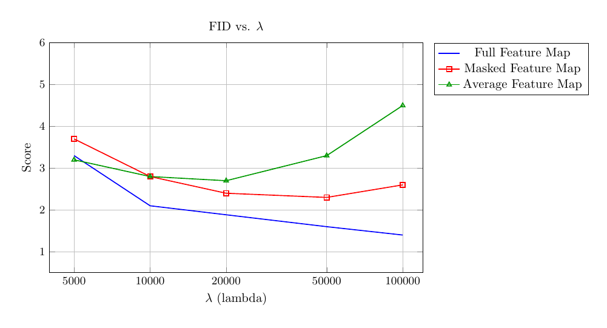 
    </td>
    <td align="center">
      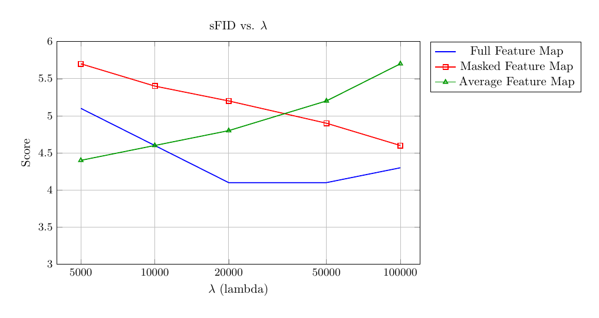 
    </td>
    <td align="center">
      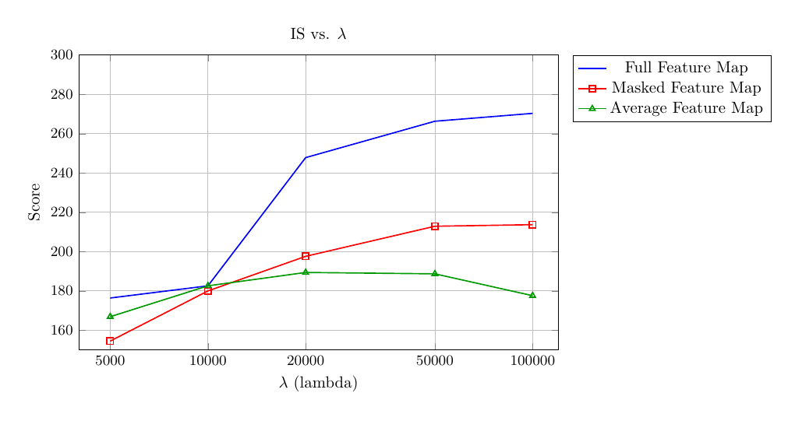 
    </td>
  </tr>
  <tr>
    <td align="center">
      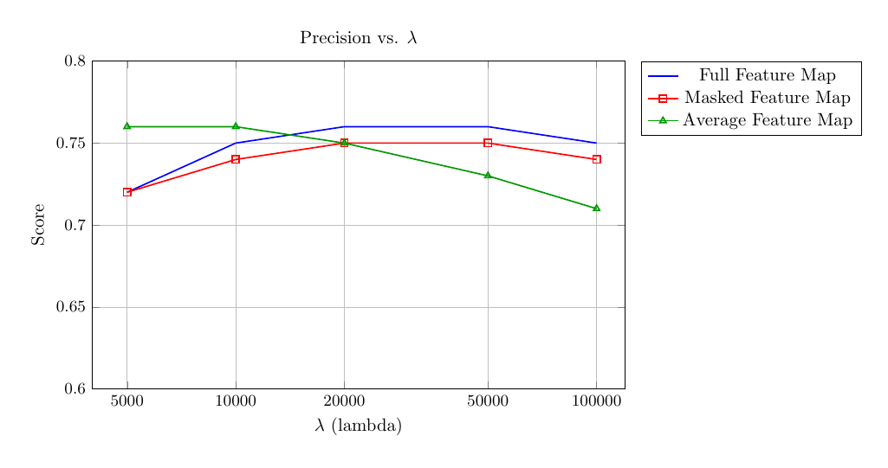 
    </td>
    <td align="center">
      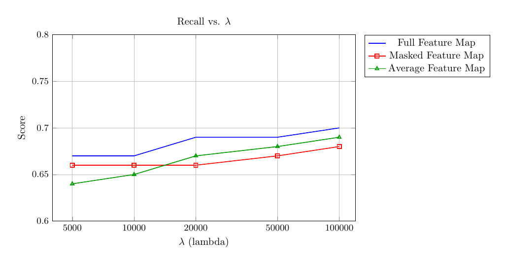 
    </td>
  </tr>
</table>

### Single-source experiments on instance-level metrics

<table>
  <tr>
    <td align="center">
      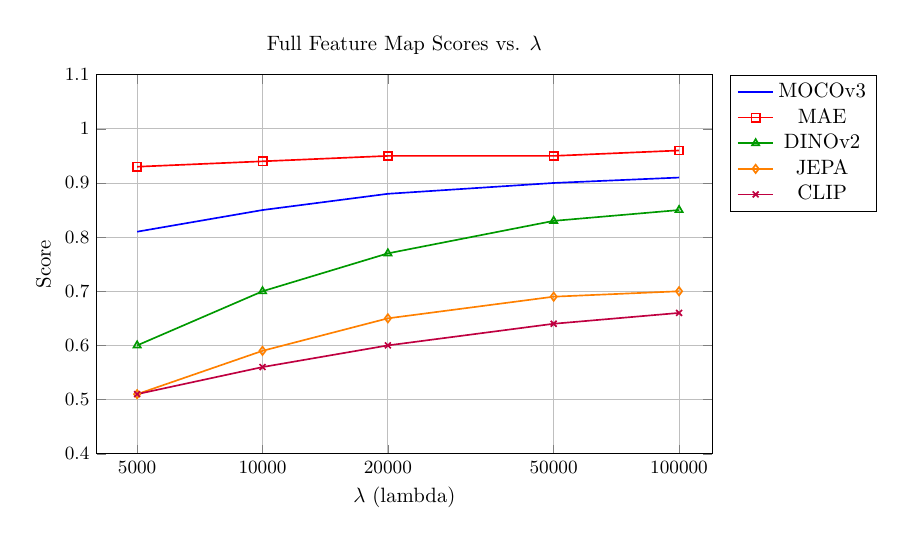 
    </td>
    <td align="center">
      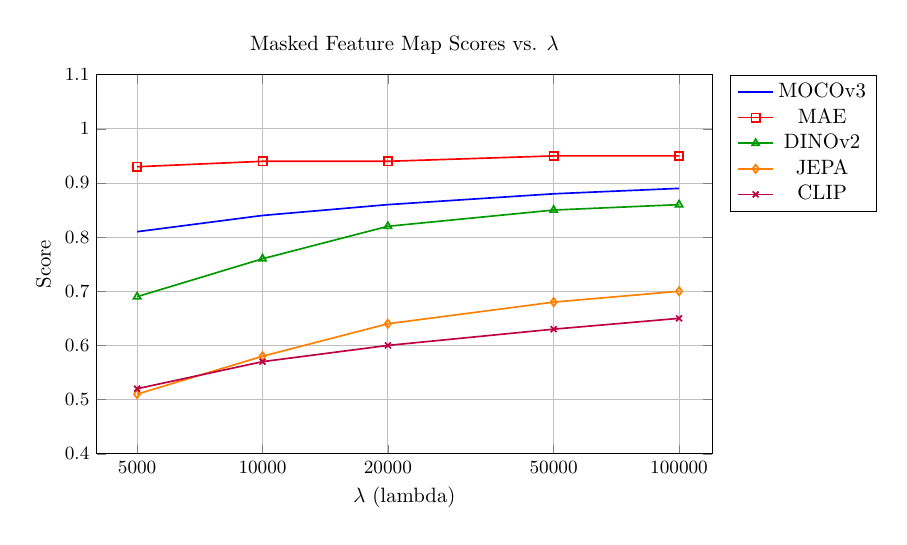 
    </td>
    <td align="center">
      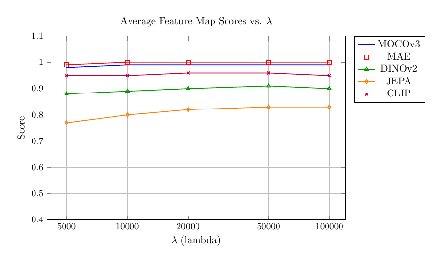 
    </td>
  </tr>
</table>

### Multi-source experiments on CLIP Score

<table>
  <tr>
    <td align="center">
      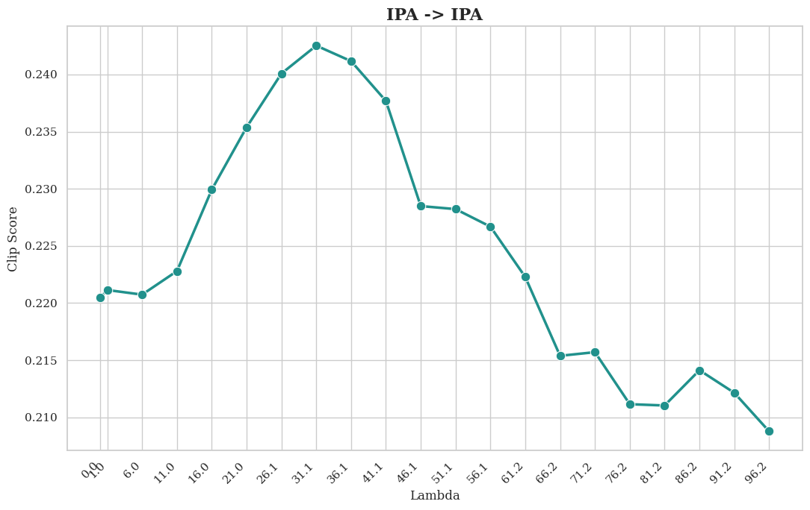 
    </td>
    <td align="center">
      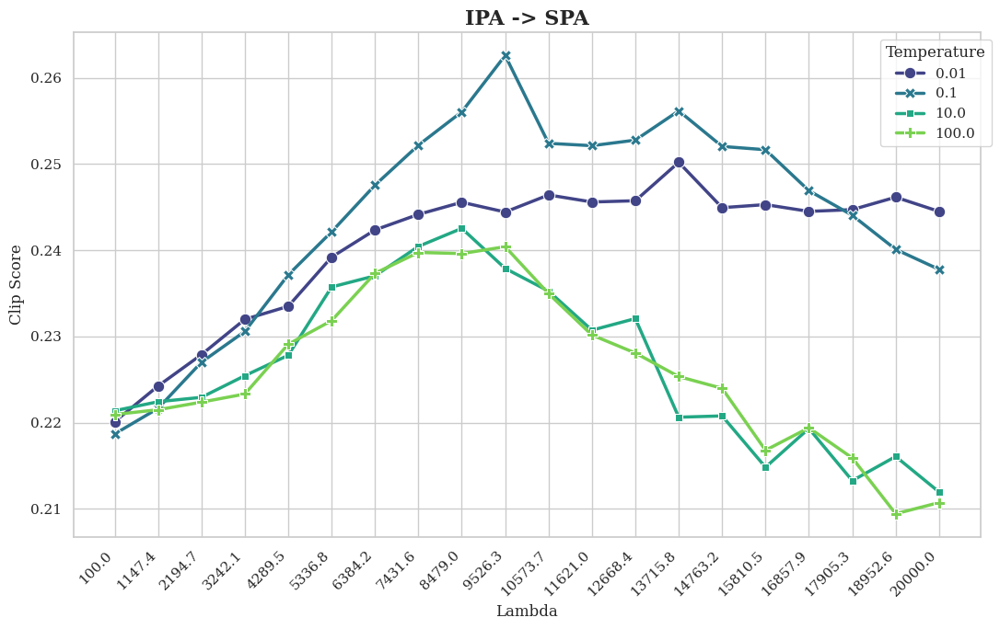 
    </td>
  </tr>
</table>

### Multi-source experiments on Pick Score

<table>
  <tr>
    <td align="center">
      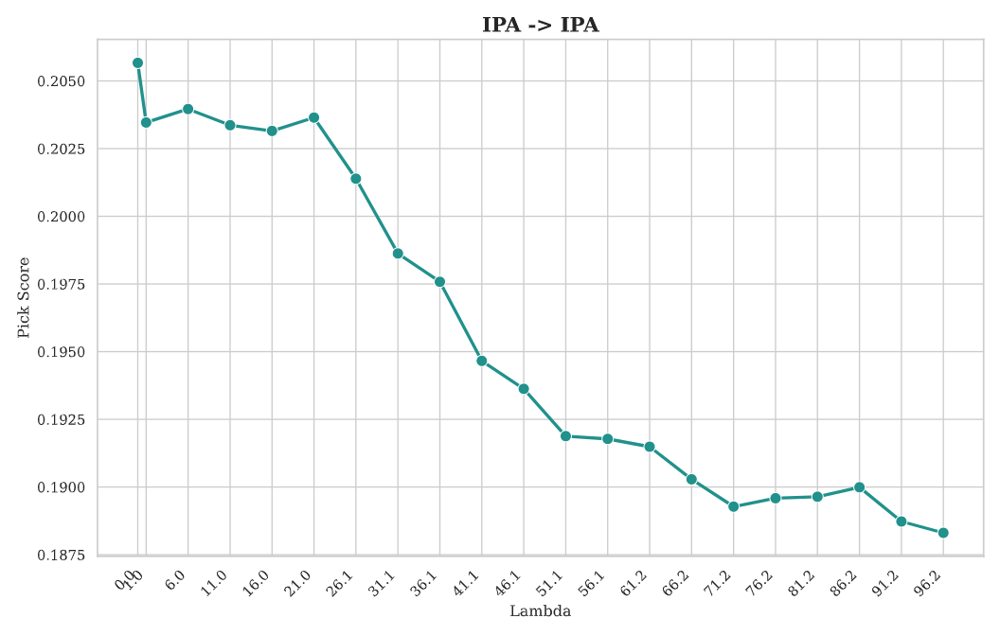 
    </td>
    <td align="center">
      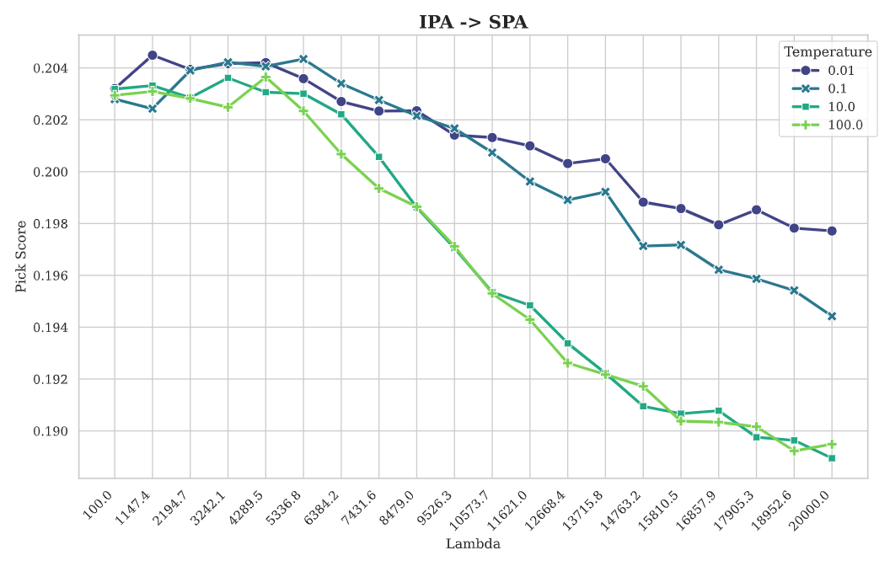 
    </td>
  </tr>
</table>

## 2. Failure Cases 

## 3. Results on Different Self-supervised Alignment Backbones

### Perception Encoder
<table>
  <tr>
    <td align="center">
       
    </td>
    <td align="center">
       
    </td>
    <td align="center">
       
    </td>
  </tr>
  <tr>
    <td align="center">
       
    </td>
    <td align="center">
       
    </td>
    <td align="center">
       
    </td>
  </tr>
  <tr>
    <td align="center">
       
    </td>
    <td align="center">
       
    </td>
    <td align="center">
       
    </td>
  </tr>
</table>

### CLIP
<table>
  <tr>
    <td align="center">
       
    </td>
    <td align="center">
       
    </td>
    <td align="center">
       
    </td>
  </tr>
  <tr>
    <td align="center">
       
    </td>
    <td align="center">
       
    </td>
    <td align="center">
       
    </td>
  </tr>
  <tr>
    <td align="center">
       
    </td>
    <td align="center">
       
    </td>
    <td align="center">
       
    </td>
  </tr>
</table>

### DINOv2
<table>
  <tr>
    <td align="center">
       
    </td>
    <td align="center">
       
    </td>
    <td align="center">
       
    </td>
  </tr>
  <tr>
    <td align="center">
       
    </td>
    <td align="center">
       
    </td>
    <td align="center">
       
    </td>
  </tr>
  <tr>
    <td align="center">
       
    </td>
    <td align="center">
       
    </td>
    <td align="center">
       
    </td>
  </tr>
</table>

## 4. Qualitative Results from IP-Adapter
<table>
    <tr>
    <th align="center">Anchor Image (Avg. feature map)</th>
    <th align="center">REPA-G</th>
    <th align="center">Adapter</th>
  </tr>
  <tr>
    <td align="center">
       
    </td>
    <td align="center">
       
    </td>
    <td align="center">
      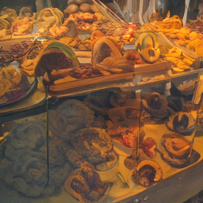 
    </td>
  </tr>
  <tr>
    <td align="center">
       
    </td>
    <td align="center">
       
    </td>
    <td align="center">
       
    </td>
  </tr>
  <tr>
    <td align="center">
      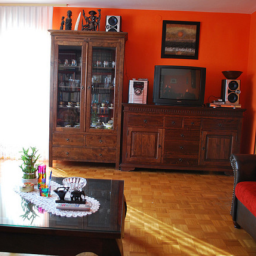 
    </td>
    <td align="center">
       
    </td>
    <td align="center">
      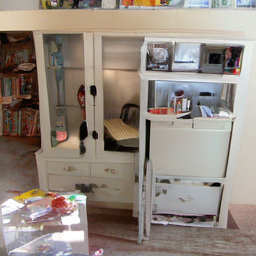 
    </td>
  </tr>
</table>

## 5. Qualitative results from TFG
<table>
    <tr>
    <th align="center">Anchor Image (Full feature map)</th>
    <th align="center">REPA-G</th>
    <th align="center">TFG</th>
  </tr>
  <tr>
    <td align="center">
       
    </td>
    <td align="center">
       
    </td>
    <td align="center">
       
    </td>
  </tr>
  <tr>
    <td align="center">
       
    </td>
    <td align="center">
       
    </td>
    <td align="center">
       
    </td>
  </tr>
  <tr>
    <td align="center">
       
    </td>
    <td align="center">
       
    </td>
    <td align="center">
       
    </td>
  </tr>
</table>

## 6. Qualitative results from High Resolution Generations ($512 \times 512$)

<table>
    <tr>
    <th align="center">Anchor Image (Full feature map)</th>
    <th align="center">REPA-G Resolution 512x512</th>
  </tr>
  <tr>
    <td align="center">
       
    </td>
    <td align="center">
       
    </td>
  </tr>
  <tr>
    <td align="center">
       
    </td>
    <td align="center">
       
    </td>
  </tr>
  <tr>
    <td align="center">
       
    </td>
    <td align="center">
      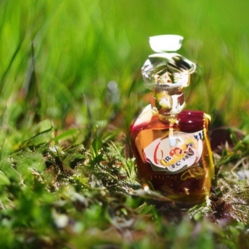 
    </td>
  </tr>
</table>
